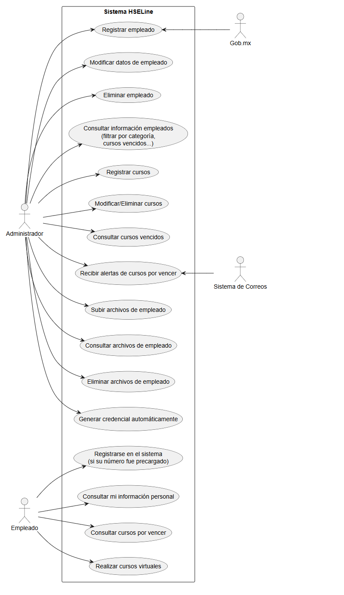

# Análisis

## Antecedentes

El departamento QHSE de una empresa petrolera, requiere mejorar su sistema de trabajo actual para hacerlo mas eficiente. Las principales actividades de este departamento son:

- Generación de contratos: estos contratos se generan cuando el departamento de ventas vende o renta un servicio a un cliente del sector petrolero para llevar a acabo esta negociación el cliente solicita el alta del personal (empleado), de acuerdo a las categorías (especialidad del empleado) del servicio brindado.

- Realizar cursos de SSPA para los trabajadores, con estos los trabajadores se renuevan sus certificados.

## Pasos elaboración de contrato

1. Una vez ya acordado el servicio el cliente comparte formatos en word y excel, aquí entra la tarea del administrador para realizar la alta de dicho servicio. En el formato de excel se coloca la vigencia de los cursos del anexo SSPA del empleado y en word se utiliza para crear el cv del trabajador. Estos formatos son llenado con información que facilita el departamento de RH, los formatos de los documentos Varian de acuerdo a la empresa y categoría, asi que no siempre son los mismos. Una vez que se realiza el llenado de los documentos estos se reenvían a la empresa contratante. El administrador conserva una copia del archivo para documentación.

2. El administrador realiza la constancia laboral del trabajador, esta constancia debe mencionar fecha de comienzo de labores en la empresa, categoría y si se encuentra trabajando actualmente en la empresa. 

3. También realiza la credencial de la empresa para el trabajador esta incluye foto, nombre completo, puesto, vigencia, CURP, numero de NSS, tipo de sangre y numero de emergencia.

4. Teniendo estos documentos se comienza con la elaboración del CV alta del trabajador, se necesita conocer si la categoría del trabajador corresponda con la del servicio ofrecido por ventas y ademas este cuente con la experiencia para poder realizar el servicio. En el CV de alta se incluye nombre completo, profesión, certificado de estudio máximo, categoría para el servicio, idioma, nacionalidad, teléfono y correo electrónico. En el cv del alta va categoría a desempeñar, fecha de inicio en la empresa actual, fecha de termino esto para determinar el tiempo de experiencia que cuenta el trabajador el cual se especifica en el contrato, la empresa contratante, pequeña descripción de labores, se incluye los nombres de cursos que el trabajador ha recibido para poder ejercer la categoría propuesta, una vez teniendo el cv de alta listo, se anexan los siguientes documentos en pdf al contrato: INE, certificado máximo de estudios, certificado laborar de la empresa actual, constancias de experiencias laborales, certificados SSPA, cursos técnicos, vale de epp (equipo de protección personal), credencial de empresa, certificado medico que lo emite un medico de salud ocupacional y el alta ante el IMSS.

5. El administrador usa un excel para llevar el control de los contratos que se realizan, en este documento reúne el nombre completo, profesión, empresa, puesto, fecha inicio, fecha termino, años laborados, total de años de experiencia, categoría que se dio de alta y un apartado de comentarios donde se confirma si el personal ya quedo dado de alta y puede empezar a realizar sus servicios.

### Procesos propenso a errores o tediosos.

- La elaboración de las fechas de inicio y termino para conocer el numero de años de experiencia de trabajo, esto se saca de de sus cartas laborales. Este procedimiento esta propenso a muchos errores de calculo ya que se realizan al momento con el uso de una calculadora de años.
- Escribir en cada matriz la fecha de los cursos de acuerdo a los documentos por empresa. Las matrices suelen cambiar de acuerdo a empresas diferentes. Esto hace que se a difícil automatizar este tipo de procedimiento.
- Las credenciales cambian en las categorías. No todas las compañías solicitan las credenciales de la misma forma pero estos suelen ser cambios mínimos entre una y otras

### Requisitos para el software

Generación de contratos:

- Alarmas de vigencias de cursos. Alarmas automáticas que indiquen si los cursos del trabajador están por vencer, para asi evitar perdida de contratos por trabajadores con cursos vencidos.
- Centralizar información para su consulta rápida y en un solo lugar. Que sirva de registro. Mantener la información en un solo lugar accesible puede ayudar al administrador a consultar toda la información del trabajador en un solo lugar, evitando los documentos repartidos como los maneja actualmente el sistema.
- Que se escaneen los documentos para extraer fecha de vigencia del curso. Realizar la extracción automática por medio de escaneo de imagen en un documento seria util al momento de recolectar fechas de vigencia de cursos.
- Que se pueda saber si el agente capacitador externo esta registrado en la STPS este nombre viene en el certificado. Los datos del capacitador viene en la constancia. Esto se podría hacer al consultar la pagina de la STPS y recuperar la información de manera automática introduciendo el nombre del capacitador.
- Elaboración de credencial del trabajador automática, esta se puede realizar una vez cargada toda la info del trabajador. Ya que son datos repetitivos y no varían mucho dependiendo la empresa.
- Almacenamiento de documentos que se adjuntan en el CV de alta del empleado, con esto se puede acceder a ellos de manera rápida al momento de elaborar un contrato, aparte de tener un sistema de carpetas de manera organizada.
- Realizar calculo automático de años laborales del trabajador.

## Futuro del software

El cliente piensa que el software podría requerir el aumento de un modulo para los empleados en un futuro en el que puedan con consultar sus cursos, puedan ver cuales están por vencer, consultar su información personal, realizar cursos en linea para renovar sus certificados del anexo SSPA.

## Modelo de casos de uso

#### UC 1

- Nombre: Registrar Usuario
- Actores: Administrador, gob.mx
- Descripción: Para registrar a un nuevo usuario el administrador deberá realizar los siguientes pasos:

  1. Hacer login en el sistema.
  2. El sistema detecta una cuenta de administrador y otorga una sesión con permisos de administrador.
  3. El administrador hace hover sobre el menu en el apartado de empleados.
  4. El sistema muestra las opciones dentro de la categoría de empleados.
  5. El administrador selecciona añadir empleado.
  6. El sistema devuelve un formulario a llenar que incluye:
      - Nombre completo
      - Numero de empleado
      - Profesión
      - Grado de Escolaridad
      - Categoría
      - Idiomas
      - Nacionalidad
      - Teléfono
      - Correo electrónico
      - CURP
      - Fecha de inicio de labores en la empresa
      - Número NSS
      - Vigencia de los cursos del anexo SSPA
      - Foto de empleado
      - Tipo de sangre
      - Numero de emergencia
      - Experiencia en categoría
      - Clave INE
      - Vigencia de cursos técnicos
      - Vigencia de EPP
  7. El sistema confirma algunos datos del empleado con la CURP y la pagina del gob.mx.
  7. El administrador también agregara los documentos pdf del empleado:
      - INE
      - Certificado de estudios
      - Certificado laboral de la empresa actual
      - Constancias de experiencias laborales
      - Certificados SSPA
      - Cursos técnicos
      - Vale EPP
      - Certificado medico
      - Alta de IMSS
  8. Una vez completada la información el administrador hace clic en agregar.
  9. El sistema muestra un mensaje: empleado añadido con éxito.
- Precondición: Hacer login en el sistema y tener todos los documentos del empleado.
- Postcondición: El usuario queda dado de alta en el sistema y sus datos quedan guardados en el sistema.
- Escenario: El administrador tiene los documentos del empleado y puede dar de alta al empleado sin problemas.
- Escenario alternativo: El administrador no cuenta con todos los documentos, el administrador no puede ingresar todos los datos al sistema por lo tanto es imposible agregar al nuevo empleado es sistema exige los datos completos.

#### UC 2

- Nombre: Modificar Usuario
- Actores: Administrador
- Descripción: Modificar datos del empleado, por algún error a la hora de dar de alta.
  1. Hacer login en el sistema.
  2. El sistema detecta una cuenta de administrador y otorga una sesión con permisos de administrador.
  3. El administrador hace hover sobre el menu en el apartado de empleados.
  4. El sistema muestra las opciones dentro de la categoría de empleados.
  5. El administrador selecciona la opción modificar empleado.
  6. El sistema arroja la lista de empleados activos.
  7. El empleado puede seleccionar de la lista o filtrar por nombre o numero de empleado.
  8. El sistema muestra la información del empleado seleccionado.
  9. El administrador da clic en modificar.
  10. El sistema devuelve los datos de forma que se pueden editar.
  11. El administrador hace los ajustes necesarios haciendo clic en los campos elegidos e ingresando por teclado la nueva información.
  12. Una vez terminado los ajustes el administrador hace clic sobre el botón de actualizar.
  13. El sistema muestra una pantalla de actualizado con éxito.
- Precondición: El empleado debe estar registrado en el sistema. El administrador debe hacer login.
- Postcondición: La información seleccionada queda modificada.
- Escenario alternativo: El sistema no tiene al empleado registrado, el sistema solicita dar de alta al empleado.

#### UC 3

- Nombre: Eliminar empleado
- Actores: Administrador
- Descripción: Cuando un empleado ya no se requiere en el sistema este se elimina.
  1. Hacer login en el sistema.
  2. El sistema detecta una cuenta de administrador y otorga una sesión con permisos de administrador.
  3. El administrador hace hover sobre el menu en el apartado de empleados.
  4. El sistema muestra las opciones dentro de la categoría de empleados.
  5. El administrador selecciona la opción eliminar empleado.
  6. El sistema arroja la lista de empleados activos.
  7. El empleado puede seleccionar de la lista o filtrar por nombre o numero de empleado.
  8. El sistema muestra la información del empleado seleccionado.
  9. El administrador da clic en eliminar.
  10. El sistema envía un mensaje y solicita escribir el nombre completo del empleado a eliminar por seguridad.
  11. El administrador ingresa el nombre y hace clic en eliminar.
  12. El sistema lanza un mensaje de empleado eliminado.
- Precondición: El empleado debe estar registrado en el sistema. El administrador debe hacer login.
- Postcondición: El empleado queda fuera del sistema.
- Escenario alternativo: Si el usuario no existe, no se requiere ninguna acción en el sistema.

#### UC 4

- Nombre: Consultar información de empleado
- Actores: Administrador
- Descripción: El sistema arroja la información sobre un empleado.
    1. Hacer login en el sistema.
    2. El sistema detecta una cuenta de administrador y otorga una sesión con permisos de administrador.
    3. El administrador hace clic en el menu empleado.
    4. El sistema arroja la lista de empleados actuales en el sistema.
    5. El administrador puede hacer clic sobre cualquier empleado.
    6. El sistema arroja la información del empleado.
    7. El administrador pues hacer scroll por todos los datos del empleado y copiar la información.
    8. El administrador puede descargar documentos del empleado.
    9. Una vez terminada la consulta. El usuario puede cerrar sesión.
- Precondición: El empleado debe estar dado de alta en el sistema. El administrador debe hacer login.
- Postcondición: El sistema muestra los datos por medio de la interfaz.
- Escenario alternativo: El empleado no esta dado de alta en el sistema y no puede mostrar ninguna información.

#### UC 5

- Nombre: Generación de credencial empleado
- Actores: Administrador
- Descripción: El sistema genera de manera automática una credencial en formato pdf.
  1. Hacer login en el sistema.
  2. El sistema detecta una cuenta de administrador y otorga una sesión con permisos de administrador.
  3. El administrador hace hover sobre el menu en el apartado de empleados.
  4. El sistema muestra las opciones dentro de la categoría de empleados.
  5. El administrador selecciona crear credencial.
  6. El sistema arroja la lista de empleado actuales en el sistema.
  7. El administrador selecciona al empleado.
  8. El sistema envía un documento pdf con la credencial del usuario.
  9. El administrador puede elegir entre imprimir o guardar el documento.
- Precondición: El empleado debe estar registrado en el sistema, el administrador debe hacer login.
- Postcondición: El sistema crea la credencial.
- Escenario alternativo: El empleado no esta dado de alta por lo tanto el sistema no lo reconoce y marca error.

#### UC 6

- Nombre: Login
- Actores: Administrador
- Descripción: El administrador deberá ingresar a nuestro sitio con su usuario y contraseña previamente otorgados.
  1. Entrar al sitio web de HSELine.
  2. Dar click en el botón de iniciar sesión que se encontrara en la esquina superior derecha.
  3. El sistema envía a otra ruta de la pagina donde el usuario podrá hacer login.
  4. El administrador hace login con su usuario y contraseña
  5. Si todo está correcto, el administrador le dará al botón de continuar, y habrá iniciado sesión con éxito.
  6. El sistema lo mostrara el panel de administración.
- Precondición: El administrador debe estar previamente registrado en el sistema de HSELine para poder hacer login.
- Postcondición: El administrador podrá visualizar el panel de administración de empleados y podrá realizar sus actividades.
- Escenario alternativo: El administrador no está dado de alta, por lo tanto el sistema no lo reconoce y le mostrará el siguiente mensaje "El usuario o contraseña no coinciden con los registros de nuestro sistema"

#### UC 7

- Nombre: Consultar vigencia de cursos
- Actores: Administrador
- Descripción: El administrador ingresará al panel de administración de empleados, seleccionará a uno de sus empleados y consultará la vigencia de sus cursos.
  1. Después de haber iniciado sesión, el administrador podrá visualizar el panel de control de empleados.
  2. El administrador buscará y seleccionará al empleado del que quiera observar su información mediante una barra de búsqueda, o buscando su foto y nombre en la lista de empleados.
  3. El administrador dará click en el empleado.
  4. El administrador podrá visualizar la información del empleado y podrá visualizar los cursos que tiene el empleado, tanto como los vigentes, los vencidos y los que están por vencer, para visualizar cada uno dará click en su respectivo botón.
- Precondición: El administrador ingreso al panel de administración de empleados y seleccionó el empleado a visualizar.
- Postcondición: El administrador pudo observar de manera exitosa la vigencia de los cursos de su empleado.
- Escenario alternativo: El administrador no inicio sesión. 

#### UC 8

- Nombre: Enviar alertas por correo de cursos vencer
- Actores: Sistema
- Descripción: El sistema enviará de manera automática un correo al empleado en donde le mandará una alerta de los cursos que estén por vencer y los cuales necesita renovar.
  1. El sistema detecta el curso o cursos que estén por vencer.
  2. El sistema enviará un correo de manera automatizada al empleado donde se le especificara los cursos que están por vencer y de los cuales necesita renovar.
- Precondición: El empleado debe tener cursos que estén por vencer. 
- Postcondición: El sistema le habrá enviado de manera satisfactorio el correo alertando al empleado los cursos que necesita renovar.
- Escenario alternativo: El empleado no tiene cursos que estén por vencer.

