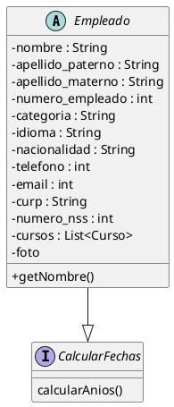

```plantuml
@startuml
skinparam classAttributeIconsize 0

abstract class Empleado {
  
  -nombre : String
  -apellido_paterno : String
  -apellido_materno : String
  -numero_empleado : int
  -categoria : String
  -idioma : String
  -nacionalidad : String
  -telefono : int
  -email : int
  -curp : String
  -numero_nss : int
  -cursos : List<Curso>
  -foto


  +getNombre()
}

interface CalcularFechas {

  calcularAnios()
}

Empleado --|> CalcularFechas
@enduml
```