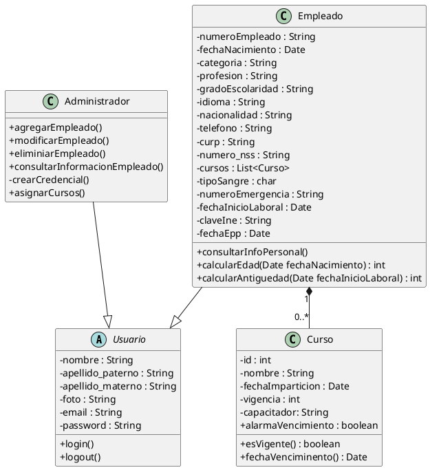

```plantuml
@startuml
skinparam classAttributeIconsize 0

abstract class Usuario {
  
  -nombre : String
  -apellido_paterno : String
  -apellido_materno : String
  -foto : String
  -email : String
  -password : String
  +login()
  +logout()

  
}

class Administrador {
+agregarEmpleado()
+modificarEmpleado()
+eliminiarEmpleado()
+consultarInformacionEmpleado()
-crearCredencial()
+asignarCursos()

}

class Empleado {

  -numeroEmpleado : String
  -fechaNacimiento : Date
  -categoria : String
  -profesion : String
  -gradoEscolaridad : String
  -idioma : String
  -nacionalidad : String
  -telefono : String
  -curp : String
  -numero_nss : String
  -cursos : List<Curso>
  -tipoSangre : char
  -numeroEmergencia : String
  -fechaInicioLaboral : Date
  -claveIne : String
  -fechaEpp : Date
  +consultarInfoPersonal()
  +calcularEdad(Date fechaNacimiento) : int
  +calcularAntiguedad(Date fechaInicioLaboral) : int
}

class Curso {
  -id : int
  -nombre : String
  -fechaImparticion : Date
  -vigencia : int
  -capacitador: String
  +esVigente() : boolean
  +fechaVenciminento() : Date
  +alarmaVencimiento : boolean
}


' Herencias
Administrador --|> Usuario
Empleado --|> Usuario

' Asociacion de composición
Empleado "1" *-- "0..*" Curso


@enduml
```