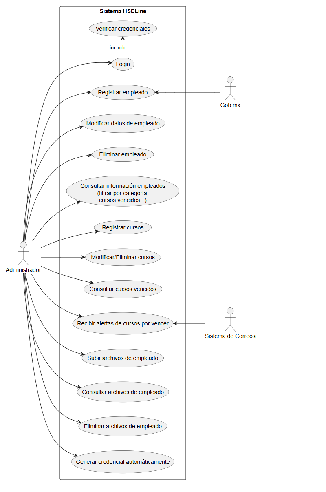

# Casos de uso - HSELine

## Antecedentes

Una empresa petrolera requiere automatizar y hacer mas eficiente su departamento QHSE, la lider de este
departamento requiere un sistema donde la información se ecuentre centralizada, el sistema debe de alojar a
toda la base de empleados para poder almacenar toda la informacion para su uso posterior, uno de los
principales procesos es la elaboracion de contratos. Para esto se necesita capturar la siguiente informacion del
empleado. Nombre, apellidos, clave de elector, vigencia de ine, fecha de nacimiento, curp, numero de
empleado, categoria, tipo de sangre, alergias, numero de empleado, años laborales. Cada empleado cuenta
con 3 tipos diferentes de certificaciones, la primera son los cursos iadc (piso de perforacion) estos cursos
tienen un numero de folio unico, una vigencia, nombre y fecha de expedicion; la segunda son los cursos de
anexo SSPA los cuales tienen vigencia, fecha de expedicion y nombre del capacitador, y por ultimo el tecer
tipo de curso son los cursos tecnicos que tienen vigencia, expedicion y estan clasificados dependiendo la
categoria del empleado. Los empleado tambien cuentan con una libreta de mar, con los los siguientes datos,
fecha de expedicion, vigencia, tipo de libreta (A o D). Los empelados deben de tener sus nss con la fecha de
alta en la compañia. Los empleado tienen un certificado medico el cual tiene vigencia y determina si el
empleado esta apto para trabajar. Cada empleado tiene un documento de entrega de epp el cual tiene una
vigencia. Los empleados tienen una credencial de empresa que se compone de nombre, apellidos, categoria,
vigencia de credencial, curp, tipo de sangre, alergia y numero de empresa, esta credencial nos gustaria crearla
de manera automatica con el sistema. Los empleado tienen cusos de barcaza los cuales tienen vigencia.

## Actores

- Administrador
- Empleado

<!-- ## Diagrama de casos de uso

```plantuml
@startuml
left to right direction

package HSELine {
  usecase "Registrar, modificar y eliminar empleados" as re
  usecase "Consultar información de empleado" as inf
  usecase "Registrar, modificar y eliminar curso" as cur
  usecase "Conocer vigencia de curso" as vig
  usecase "Consultar años trabajados" as anio
  usecase "Login"
  usecase "Verificar credenciales" as ver
  usecase "Comenzar curso" as start
}

actor Administrador as admin
actor Empleado as emp
actor :SQL server: as bd -->

<!-- admin -> re
emp -> re
admin -> inf
admin -> cur
Login .down.> ver : include
emp -> Login
emp -> vig
admin -> anio
start .> vig : exclude
inf <--- bd
@enduml
``` 
-->

### Casos de uso



### Especificaciones

#### UC 1

- Nombre: Registrar Usuario
  - Actores: Administrador, gob.mx
  - Descripción: Dar de alta al usuario nuevo en el sistema, el sistema se apoyara de diferentes sistemas como la pagina gob.mx para encontrar datos en automático.
  - Precondición: Tener todos los documentos del empleado.
  - Postcondición: El usuario queda dado de alta en el sistema.
  - Escenario: El administrador tiene los documentos del empleado y puede dar de alta al empleado sin problemas.
  - Escenario alternativo: El administrador no cuenta con todos los documentos, el administrador no puede ingresar todos los datos al sistema.

  #### UC 2

- Nombre: Modificar Usuario
  - Actores: Administrador
  - Descripción: Modificar datos del empleado, por algún error a la hora de dar de alta.
  - Precondición: El empleado debe estar registrado en el sistema.
  - Postcondición: La información seleccionada queda modificada.
  - Escenario alternativo: El sistema no tiene al empleado registrado, el sistema solicita dar de alta al empleado.

  #### UC 3

  - Nombre: Eliminar empleado
  - Actores: Administrador
  - Descripción: Cuando un empleado ya no se requiere en el sistema este se elimina.
  - Precondición: El empleado debe estar en el sistema.
  - Postcondición: El empleado queda fuera del sistema.
  - Escenario alternativo: Si el usuario no existe, no se requiere ninguna acción en el sistema.

    #### UC 4

  - Nombre: Consultar información de empleado
  - Actores: Administrador
  - Descripción: El sistema arroja la información sobre un empleado.
  - Precondición: El empleado debe estar dado de alta en el sistema.
  - Postcondición: El sistema muestra los datos por medio de la interfaz.
  - Escenario alternativo: El empleado no esta dado de alta en el sistema y no puede mostrar ninguna información.

    #### UC 5

  - Nombre: 
  - Actores: 
  - Descripción: 
  - Precondición: 
  - Postcondición: 
  - Escenario alternativo: 

    #### UC 6

  - Nombre: 
  - Actores: 
  - Descripción: 
  - Precondición: 
  - Postcondición: 
  - Escenario alternativo: 

    #### UC 7

  - Nombre: 
  - Actores: 
  - Descripción: 
  - Precondición: 
  - Postcondición: 
  - Escenario alternativo: 

    #### UC 8

  - Nombre: 
  - Actores: 
  - Descripción: 
  - Precondición: 
  - Postcondición: 
  - Escenario alternativo: 