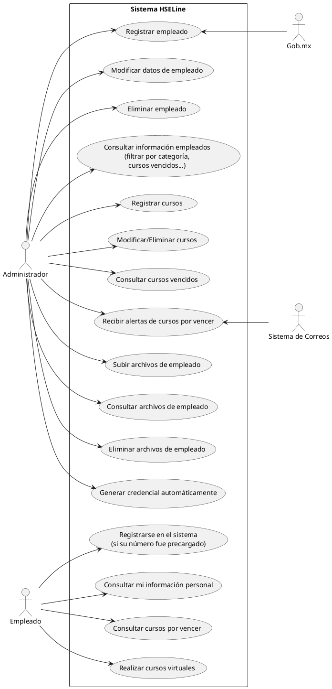

```plantuml
@startuml
left to right direction
skinparam packageStyle rectangle
actor Administrador
actor Empleado
actor "Sistema de Correos" as Mailer
actor "Gob.mx" as curp

rectangle "Sistema HSELine" {
  
  ' Casos de uso del Administrador
  usecase "Registrar empleado" as UC1
  usecase "Modificar datos de empleado" as UC2
  usecase "Eliminar empleado" as UC3
  usecase "Consultar información empleados\n(filtrar por categoría,\ncursos vencidos...)" as UC4
  usecase "Registrar cursos" as UC5
  usecase "Modificar/Eliminar cursos" as UC6
  usecase "Consultar cursos vencidos" as UC7
  usecase "Recibir alertas de cursos por vencer" as UC8
  usecase "Subir archivos de empleado" as UC9
  usecase "Consultar archivos de empleado" as UC10
  usecase "Eliminar archivos de empleado" as UC11
  usecase "Generar credencial automáticamente" as UC12

  ' Casos de uso del Empleado
  usecase "Registrarse en el sistema\n(si su número fue precargado)" as UC13
  usecase "Consultar mi información personal" as UC14
  usecase "Consultar cursos por vencer" as UC15
  usecase "Realizar cursos virtuales" as UC16


  ' Relaciones del Administrador
  Administrador --> UC1
  Administrador --> UC2
  Administrador --> UC3
  Administrador --> UC4
  Administrador --> UC5
  Administrador --> UC6
  Administrador --> UC7
  Administrador --> UC8
  Administrador --> UC9
  Administrador --> UC10
  Administrador --> UC11
  Administrador --> UC12

  ' Relaciones del Empleado
  Empleado --> UC13
  Empleado --> UC14
  Empleado --> UC15
  Empleado --> UC16

  ' Relación del sistema con módulo externo de alertas
  UC8 <-down- Mailer
  ' Relación del sistema con módulo externo de datos personales
  UC1 <-down- curp
}

@enduml
```